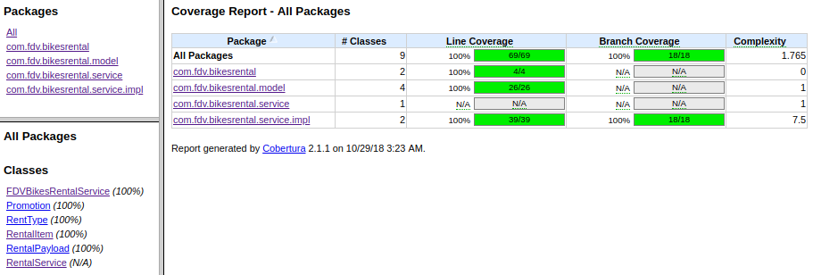

# Bikes rental exercise

 

## Practices used
- ##### SOLID
- ##### Builder pattern
- ##### Logging
- ##### Use of RESTful responses [RFC 2616](https://www.ietf.org/rfc/rfc2616.txt)

## Testing execution
- To check the cases included in the exercise, just run `mvn test`. 
All tests are located in `src/test/java/com/fdv/bikesrental/service/FDVBikesRentalServiceTest.java`
- To check the coverage for each of the classes, execute `mvn cobertura:cobertura` and then check the report located in `target/site/cobertura/index.html`

